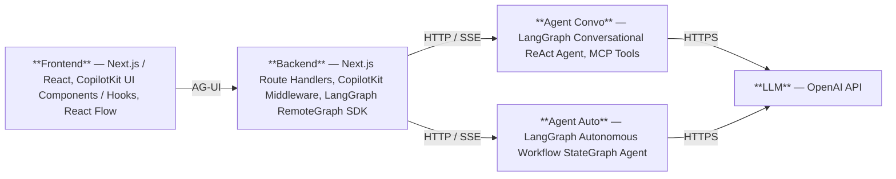

# Agentic Interface (Proof of concept)

Proof-of-concept frontend for agentic workflows supporting streaming visual graph rendering.

# Architecture



# Prerequisites

- Node.js v24.11.0 or greater (nvm recommended for managing multiple Node.js versions)
- Python 3.14 installed
  - `uv python install 3.14`
- OpenAI account with an API key (used by all agents)
- LangSmith account with an API key (used by agent-auto for tracing); sign up at https://smith.langchain.com

# Install, Build and Run

## Agent - Conversational

A conversational [LangGraph](https://www.langchain.com/langgraph) ReAct agent with an [MCP](https://modelcontextprotocol.io/) tool, served via the LangGraph dev server.

```bash
cd agent-convo
cp .env.example .env          # then add your OPENAI_API_KEY to .env
uv sync                       # creates .venv and installs dependencies
uv run langgraph dev          # starts the server at http://localhost:2024
```

## Agent - Autonomous

An autonomous [LangGraph](https://www.langchain.com/langgraph) agent that executes multi-step workflows with branch decisions, served via the LangGraph dev server.

```bash
cd agent-auto
cp .env.example .env               # then add your OPENAI_API_KEY and LANGSMITH_API_KEY to .env
uv sync                            # creates .venv and installs dependencies
uv run langgraph dev --port 2025   # starts the server at http://localhost:2025
```

> **Note:** `agent-convo` runs on port 2024 and `agent-auto` on port 2025 — both can be started simultaneously.

## Frontend

A UI supporting streaming chat, tool call visual renderers and streaming visual graph rendering built with [Next.js](https://nextjs.org/), [CopilotKit](https://www.copilotkit.ai/), [AG-UI](https://docs.ag-ui.com/) and [React Flow](https://reactflow.dev/), connecting to the Agent - Conversational LangGraph agent.

```bash
cd frontend
cp .env.local.example .env.local   # already pre-filled with localhost default
npm install
npm run dev                        # starts on http://localhost:3000
```

> **Note:** The `agent-convo` and `agent-auto` agents must be running (see above sections) before starting the frontend so the `/api/copilotkit` route can reach the agents.
