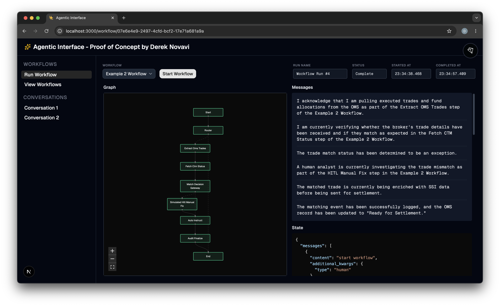
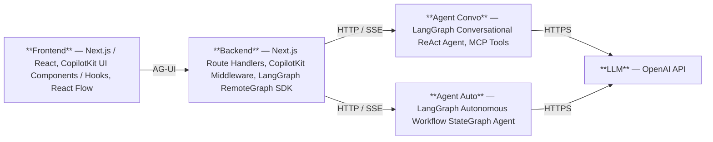

# Agentic Interface (Proof of concept)

Proof-of-concept frontend for the emerging area of agentic workflows - supporting real-time streaming graph visualization. Note that this is very much a work in progress.



# Architecture



# Prerequisites

- Node.js v24.11.0 or greater (nvm recommended for managing multiple Node.js versions)
- Python 3.14 installed
  - `uv python install 3.14`
- OpenAI account with an API key (used by all agents)
- LangSmith account with an API key (used by `agent-auto` for tracing); sign up at https://smith.langchain.com

# Install, Build and Run

## Agent - Conversational

A conversational ReAct agent built with [Python](https://www.python.org/), [LangGraph](https://www.langchain.com/langgraph) and [MCP](https://modelcontextprotocol.io/) tools, served via the LangGraph dev server.

```bash
cd agent-convo
cp .env.example .env          # then add your OPENAI_API_KEY to .env
uv sync                       # creates .venv and installs dependencies
uv run langgraph dev          # starts the server at http://localhost:2024
```

## Agent - Autonomous

An autonomous agent built with [Python](https://www.python.org/) and [LangGraph](https://www.langchain.com/langgraph) that executes multi-step workflows with branch decisions, served via the LangGraph dev server.

```bash
cd agent-auto
cp .env.example .env               # then add your OPENAI_API_KEY and LANGSMITH_API_KEY to .env
uv sync                            # creates .venv and installs dependencies
uv run langgraph dev --port 2025   # starts the server at http://localhost:2025
```

> **Note:** `agent-convo` runs on port 2024 and `agent-auto` on port 2025 — both can be started simultaneously.

## Frontend

A frontend supporting streaming chat, tool call visual renderers and real-time streaming graph visualization built with [Next.js](https://nextjs.org/), [CopilotKit](https://www.copilotkit.ai/), [AG-UI](https://docs.ag-ui.com/) and [React Flow](https://reactflow.dev/), connecting to the **Agent - Conversational** and **Agent - Autonomous** LangGraph agents.

```bash
cd frontend
cp .env.local.example .env.local   # already pre-filled with localhost default for agents
npm ci
npm run dev                        # starts on http://localhost:3000
```

> **Note:** The `agent-convo` and `agent-auto` agents must be running (see above sections) before starting the frontend so the `/api/copilotkit` Next.js route can reach the agents.

## Potential Further Work

If this work was taken further, next steps would likely include some of the following:

- Iterate on `agent-auto` to make it more real-world:
  - Steps that invoke MCP tools to retrieve data based on (a) workflow run parameters; and (b) state of previous nodes.
  - Decision nodes that reason about MCP tool results, etc. to determine the appropriate next path.
  - HITL interrupts to escalate issues that cannot be resolved by the agent and require attention from humans.
  - Long-term persistence of historic workflow run data.
  - Observability and monitoring of workflow autonomous steps and HITL actions for operations users.
  - Kill switches for operations users.
- Iterate on `frontend` to support:
  - An inspector panel to display the underlying data used by each node of a given workflow graph.
  - HITL approve / modifiy / reject actions based on HITL interrupts in workflows.
  - Proper UX for the streaming graph visualization.
  - AuthN and AuthZ.
  - Multi-user support - view permissioned/relevant workflows initiated by other team members.
  - Views to support different user personas.
  - Higher-level views e.g. a larger surface area to pan and zoom across multiple workflow graphs.
  - Ability to drill into sub-graphs in workflows.
  - Consideration of alternative mechanisms to visualize workflows.
  - Consideration of using Generative UI techniques such as A2UI for some aspects of the frontend.
  - Support for launching and sharing context with separate, related applications from appropriate nodes in workflow graphs.
  - Dedicated page for alerts, actions and HITL items (arguably this should be the default page).
  - Dashboard pages for leadership and operations to show overall trends, performance, bottlenecks, issues, etc.

## Implementation Notes

The proof-of-concept was built rapidly to provide a starting point to demonstrate some of the important considerations in creating Agentic Interfaces. In particular, the following things should be called out:

- It was built with Claude Code using default model - which in practice means mostly Sonnet 4.6.
- In addition to the the output (this project) the process served as a useful exercise in AI-augmented development.
- Sonnet 4.6 was mostly quite effective, because discipline was taken to (a) use a spec-driven development approach; and (b) ensure appropriate guidance / steering during investigation and research stages in order to avoid going down blind alleys.
- Sonnet 4.6 did struggle to implement one particular spec (the frontend visualization one). Here, the difference between Sonnet 4.6 and Opus 4.5+ / GPT 5.2+ was very apparent!
- Note that `agent-convo` and `agent-auto` are deliberately very basic and not real-world. They provide just enough functionality to support streaming of LangGraph events, enabling translation to AG-UI events, and allowing a basic frontend to built on top.
- Before it is taken much further, the frontend would very much benefit from refactoring and the addition of unit tests!
